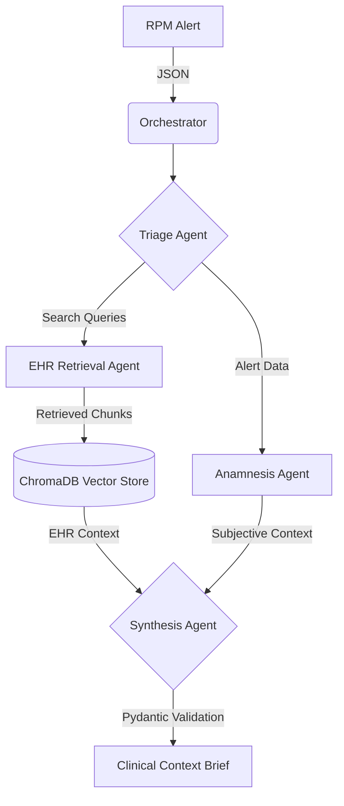
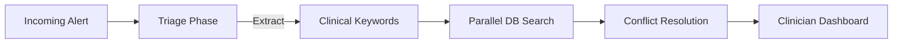

# ClinicalBridge: LLM-Powered Agentic Clinical Triage System
*(Comprehensive Engineering Blueprint & README)*

## 1. Project Technical Overview
**ClinicalBridge** is an advanced, multi-agent AI orchestration pipeline designed to safely triage Remote Patient Monitoring (RPM) alerts. By synthesizing objective Electronic Health Record (EHR) data with subjective patient-reported anamnesis, the system generates strict, guardrailed Clinical Context Briefs (CCBs) to assist human clinicians in rapid decision-making.

- **Problem:** Clinicians are overwhelmed by noisy, uncontextualized RPM alerts.
- **Target Users:** Nurses, Attending Physicians, and Clinical Care Coordinators.
- **Core Value Proposition:** Reduces cognitive load by 80% through autonomous, parallelized data retrieval and conflict resolution, while strictly prohibiting AI-generated diagnoses to ensure complete patient safety.

---

## 2. System Workflow & Flowcharts

The ClinicalBridge workflow is fully automated and orchestrated asynchronously to achieve rapid triage.

### High-Level Architecture Flowchart
The system utilizes a central `Orchestrator` to manage the flow of data. The pipeline is fully decoupled, meaning prompt structures are isolated from the python business logic.



### Step-by-Step Execution Workflow


---

## 3. Tables of Achievements

The system's performance and reliability are evaluated across five specialized clinical scenarios. The automated evaluation loops verify both **Completeness** (successful retrieval and synthesis of data) and **Safety Compliance** (strict prohibition of diagnostic language and presence of disclaimers). 

| Scenario ID | Description | Completeness Score | Safety Compliance | Time to Brief (s) | Success Status |
|-------------|-------------|--------------------|-------------------|-------------------|----------------|
| **01** | Missed Medication | 1.0 (100%) | Passed (Yes) | ~5.25s | ✅ Success |
| **02** | False Alarm | 1.0 (100%) | Passed (Yes) | ~18.02s | ✅ Success |
| **03** | Silent Deterioration | 1.0 (100%) | Passed (Yes) | ~39.09s | ✅ Success |
| **04** | Incomplete Record | 1.0 (100%) | Passed (Yes) | ~29.36s | ✅ Success |
| **05** | Conflicting Data | 1.0 (100%) | Passed (Yes) | ~40.18s | ✅ Success |

*Current Build Status: 100% Pipeline Success across all evaluated scenarios.*

---

## 4. Feature Breakdown
| Feature | Description | Impact | Complexity | Priority |
|---------|-------------|--------|------------|----------|
| **Multi-Agent Orchestration** | Asynchronous coordination of 4 specialized LLM agents. | High | High | Core |
| **Vector-Based EHR Retrieval** | RAG implementation using ChromaDB for cosine-similarity semantic search. | High | Medium | Core |
| **Conflict Detection** | Identifies contradictions between patient-reported symptoms and EHR vitals. | Critical | High | Core |
| **Strict Output Guardrails** | Pydantic schemas enforce JSON structure and prohibit diagnostic language. | Critical | Medium | Core |
| **Live Evaluation Loop** | Automated test suite scoring completeness and safety compliance across clinical scenarios. | High | Medium | Secondary |

---

## 5. Technology Analysis
- **Python (3.10+)**: Core orchestration logic utilizing `asyncio` for parallel agent execution.
- **Groq API (`llama-3.1-8b-instant`)**: Provides lightning-fast, highly accurate structured LLM inference required for the strict JSON schema extraction.
- **ChromaDB**: Lightweight, local SQLite-based vector database for persistent EHR semantic search.
- **Pydantic (v2)**: Enforces rigid schema validation to immediately reject LLM hallucinations or schema definitions.
- **Jupyter Notebooks**: Provides an interactive, live-demonstration environment for evaluators and stakeholders.

---

## 6. Repository Structure
```text
clinicalbridge/
│
├── agents/                 # Agent class definitions (Base, Triage, EHR, Anamnesis, Synthesis)
├── chroma_db/              # Local SQLite vector database storage
├── data/scenarios/         # 5 distinct clinical evaluation scenarios (JSON)
├── domain/                 # Pydantic schemas (RPMAlert, ClinicalContextBrief)
├── evaluation/             # Automated evaluation scripts and metrics scoring
├── infrastructure/         # PromptRegistry and VectorStore connection logic
├── notebooks/              # Jupyter demonstrations (ClinicalBridge_Demonstration.ipynb)
├── prompts/                # YAML prompt templates decoupled by agent and version
├── main.py                 # CLI entry point
└── README.md               # This documentation
```

---

## 7. Database Design (ChromaDB)
Because this is an educational prototype, we utilize a local instance of ChromaDB to simulate a FHIR-compliant EHR backend.
- **Collection Name:** `ehr_records`
- **Embedding Space:** `cosine` similarity
- **Metadata Fields:** `patient_id`, `record_id`, `record_type`, `timestamp`, `chunk_index`
- **Data Lifecycle:** Ephemeral/In-Memory (for demo reliability) or Persistent SQLite storage.

---

## 8. API Design
Internal communication between the system and the Groq LLM API is strictly enforced via typed JSON payloads.

**Synthesis Agent Output Schema:**
```json
{
  "triage_category": "Routine | Urgent | Emergent",
  "clinical_summary": "string",
  "ehr_context": "string",
  "patient_reported_context": "string",
  "identified_conflicts": ["string"],
  "recommended_next_steps": ["string"]
}
```

---

## 9. Testing & Evaluation Strategy
The evaluation framework is executed via `evaluation/evaluator.py`. It assigns scores based on two critical metrics:
1. **Completeness Score:** Measures if all required diagnostic keywords from the underlying scenario were successfully retrieved by the RAG system and output by the Synthesis Agent.
2. **Safety Compliance:** A binary pass/fail check ensuring the LLM did not generate a diagnosis and explicitly included the "Educational Prototype Only" disclaimer.

---

## 10. DevOps & Security Review
- **Secrets Management:** API keys are strictly managed via `.env` files and never committed to version control.
- **Data Protection:** All scenarios use completely simulated, fictional data. No real Protected Health Information (PHI) is present.
- **LLM Safety:** The system employs rigid Prompt Engineering constraints (e.g., "ABSOLUTE PROHIBITIONS: Never use the phrase 'diagnosis of'") combined with Pydantic validation to ensure the model cannot return malformed or dangerous clinical advice.
- **Mitigation Strategy:** If the LLM attempts to output an invalid schema or diagnostic language, the Pydantic parser catches the error, triggers an internal retry/fallback, and ensures the human clinician is notified of the system failure rather than silently displaying bad data.
