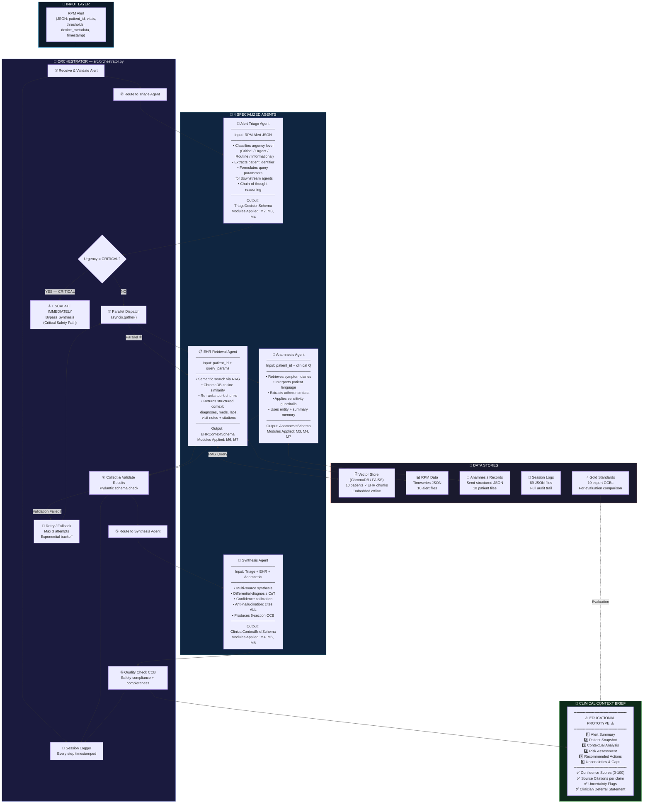

# 10.1 High-Level System Architecture

```mermaid
graph TB
    subgraph INPUT["📡 INPUT LAYER"]
        RPM["RPM Alert\n(JSON: patient_id, vitals,\nthresholds, device_metadata, timestamp)"]
    end

    subgraph ORCH["🎯 ORCHESTRATOR — src/orchestrator.py"]
        direction TB
        O1["① Receive & Validate Alert"]
        O2["② Route to Triage Agent"]
        O3{"Urgency = CRITICAL?"}
        O4["③ Parallel Dispatch\nasyncio.gather()"]
        O5["④ Collect & Validate Results\nPydantic schema check"]
        O6["⑤ Route to Synthesis Agent"]
        O7["⑥ Quality Check CCB\nSafety compliance + completeness"]
        O8["⚠️ ESCALATE IMMEDIATELY\nBypass Synthesis\n(Critical Safety Path)"]
        O9["🔄 Retry / Fallback\nMax 3 attempts\nExponential backoff"]
        SLOG["📝 Session Logger\nEvery step timestamped"]
    end

    subgraph AGENTS["🤖 4 SPECIALIZED AGENTS"]
        TA["🚨 Alert Triage Agent\n─────────────────\nInput: RPM Alert JSON\n─────────────────\n• Classifies urgency level\n  (Critical / Urgent /\n   Routine / Informational)\n• Extracts patient identifier\n• Formulates query parameters\n  for downstream agents\n• Chain-of-thought reasoning\n─────────────────\nOutput: TriageDecisionSchema\nModules Applied: M2, M3, M4"]

        EHR["📋 EHR Retrieval Agent\n─────────────────\nInput: patient_id + query_params\n─────────────────\n• Semantic search via RAG\n• ChromaDB cosine similarity\n• Re-ranks top-k chunks\n• Returns structured context:\n  diagnoses, meds, labs,\n  visit notes + citations\n─────────────────\nOutput: EHRContextSchema\nModules Applied: M6, M7"]

        ANA["💬 Anamnesis Agent\n─────────────────\nInput: patient_id + clinical Q\n─────────────────\n• Retrieves symptom diaries\n• Interprets patient language\n• Extracts adherence data\n• Applies sensitivity guardrails\n• Uses entity + summary memory\n─────────────────\nOutput: AnamnesisSchema\nModules Applied: M3, M4, M7"]

        SYN["🔬 Synthesis Agent\n─────────────────\nInput: Triage + EHR + Anamnesis\n─────────────────\n• Multi-source synthesis\n• Differential-diagnosis CoT\n• Confidence calibration\n• Anti-hallucination: cites ALL\n• Produces 6-section CCB\n─────────────────\nOutput: ClinicalContextBriefSchema\nModules Applied: M4, M6, M8"]
    end

    subgraph DATASTORES["💾 DATA STORES"]
        VS["🗄️ Vector Store\n(ChromaDB / FAISS)\n10 patients × EHR chunks\nEmbedded offline"]
        RPMDB["📊 RPM Data\nTimeseries JSON\n10 alert files"]
        ANADB["📝 Anamnesis Records\nSemi-structured JSON\n10 patient files"]
        LOGS["📁 Session Logs\n89 JSON files\nFull audit trail"]
        GOLD["⭐ Gold Standards\n10 expert CCBs\nFor evaluation comparison"]
    end

    subgraph OUTPUT["📄 CLINICAL CONTEXT BRIEF"]
        CCB["━━━━━━━━━━━━━━━━━━━━━━━\n⚠️ EDUCATIONAL PROTOTYPE ⚠️\n━━━━━━━━━━━━━━━━━━━━━━━\n1️⃣ Alert Summary\n2️⃣ Patient Snapshot\n3️⃣ Contextual Analysis\n4️⃣ Risk Assessment\n5️⃣ Recommended Actions\n6️⃣ Uncertainties & Gaps\n━━━━━━━━━━━━━━━━━━━━━━━\n✅ Confidence Scores (0-100)\n✅ Source Citations per claim\n✅ Uncertainty Flags\n✅ Clinician Deferral Statement"]
    end

    RPM --> O1 --> O2 --> TA
    TA --> O3
    O3 -->|"YES — CRITICAL"| O8
    O3 -->|"NO"| O4
    O4 -->|"Parallel ①"| EHR
    O4 -->|"Parallel ②"| ANA
    EHR <-->|"RAG Query"| VS
    EHR <--> RPMDB
    ANA <--> ANADB
    EHR --> O5
    ANA --> O5
    O5 -->|"Validation Failed?"| O9
    O9 --> O4
    O5 --> O6 --> SYN --> O7 --> CCB
    O1 --> SLOG
    O5 --> SLOG
    O7 --> SLOG
    GOLD -.->|"Evaluation"| CCB

    style INPUT fill:#0d1b2a,stroke:#4fc3f7,color:#fff
    style ORCH fill:#1a1a3e,stroke:#7986cb,color:#fff
    style AGENTS fill:#0f2540,stroke:#4db6ac,color:#fff
    style DATASTORES fill:#1a1a2e,stroke:#ff8a65,color:#fff
    style OUTPUT fill:#0d2b1a,stroke:#66bb6a,color:#fff
```
