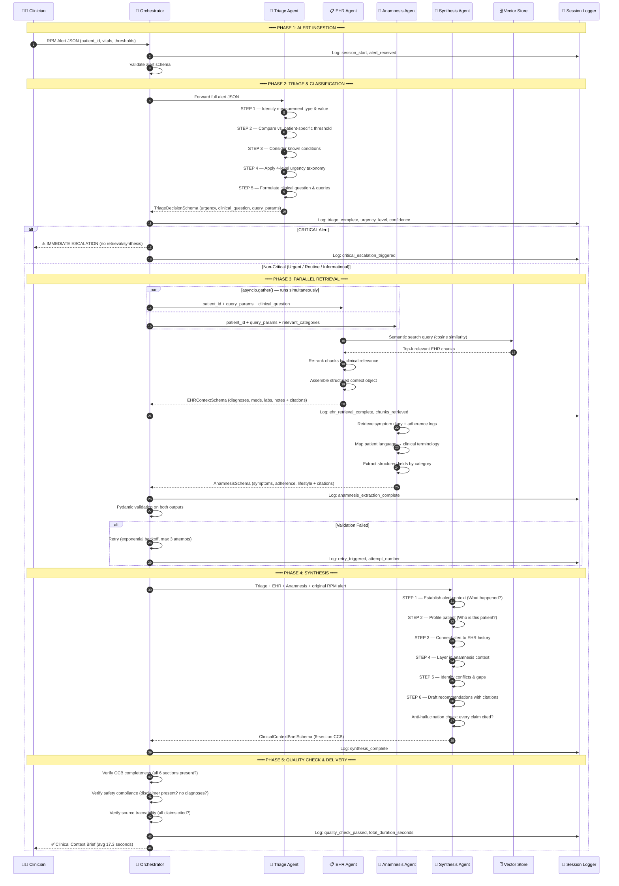

# 10.2 Step-by-Step Data Flow Sequence

```mermaid
sequenceDiagram
    autonumber
    participant C as 👨‍⚕️ Clinician
    participant O as 🎯 Orchestrator
    participant TA as 🚨 Triage Agent
    participant EHR as 📋 EHR Agent
    participant ANA as 💬 Anamnesis Agent
    participant SYN as 🔬 Synthesis Agent
    participant VS as 🗄️ Vector Store
    participant LOG as 📝 Session Logger

    Note over C,LOG: ━━━ PHASE 1: ALERT INGESTION ━━━
    C->>O: RPM Alert JSON (patient_id, vitals, thresholds)
    O->>LOG: Log: session_start, alert_received
    O->>O: Validate alert schema

    Note over C,LOG: ━━━ PHASE 2: TRIAGE & CLASSIFICATION ━━━
    O->>TA: Forward full alert JSON
    TA->>TA: STEP 1 — Identify measurement type & value
    TA->>TA: STEP 2 — Compare vs. patient-specific threshold
    TA->>TA: STEP 3 — Consider known conditions
    TA->>TA: STEP 4 — Apply 4-level urgency taxonomy
    TA->>TA: STEP 5 — Formulate clinical question & queries
    TA-->>O: TriageDecisionSchema (urgency, clinical_question, query_params)
    O->>LOG: Log: triage_complete, urgency_level, confidence

    alt CRITICAL Alert
        O-->>C: ⚠️ IMMEDIATE ESCALATION (no retrieval/synthesis)
        O->>LOG: Log: critical_escalation_triggered
    else Non-Critical (Urgent / Routine / Informational)
        Note over C,LOG: ━━━ PHASE 3: PARALLEL RETRIEVAL ━━━
        par asyncio.gather() — runs simultaneously
            O->>EHR: patient_id + query_params + clinical_question
        and
            O->>ANA: patient_id + query_params + relevant_categories
        end

        EHR->>VS: Semantic search query (cosine similarity)
        VS-->>EHR: Top-k relevant EHR chunks
        EHR->>EHR: Re-rank chunks by clinical relevance
        EHR->>EHR: Assemble structured context object
        EHR-->>O: EHRContextSchema (diagnoses, meds, labs, notes + citations)
        O->>LOG: Log: ehr_retrieval_complete, chunks_retrieved

        ANA->>ANA: Retrieve symptom diary + adherence logs
        ANA->>ANA: Map patient language → clinical terminology
        ANA->>ANA: Extract structured fields by category
        ANA-->>O: AnamnesisSchema (symptoms, adherence, lifestyle + citations)
        O->>LOG: Log: anamnesis_extraction_complete

        O->>O: Pydantic validation on both outputs
        alt Validation Failed
            O->>O: Retry (exponential backoff, max 3 attempts)
            O->>LOG: Log: retry_triggered, attempt_number
        end

        Note over C,LOG: ━━━ PHASE 4: SYNTHESIS ━━━
        O->>SYN: Triage + EHR + Anamnesis + original RPM alert
        SYN->>SYN: STEP 1 — Establish alert context (What happened?)
        SYN->>SYN: STEP 2 — Profile patient (Who is this patient?)
        SYN->>SYN: STEP 3 — Connect alert to EHR history
        SYN->>SYN: STEP 4 — Layer in anamnesis context
        SYN->>SYN: STEP 5 — Identify conflicts & gaps
        SYN->>SYN: STEP 6 — Draft recommendations with citations
        SYN->>SYN: Anti-hallucination check: every claim cited?
        SYN-->>O: ClinicalContextBriefSchema (6-section CCB)
        O->>LOG: Log: synthesis_complete

        Note over C,LOG: ━━━ PHASE 5: QUALITY CHECK & DELIVERY ━━━
        O->>O: Verify CCB completeness (all 6 sections present?)
        O->>O: Verify safety compliance (disclaimer present? no diagnoses?)
        O->>O: Verify source traceability (all claims cited?)
        O->>LOG: Log: quality_check_passed, total_duration_seconds
        O-->>C: ✅ Clinical Context Brief (avg 17.3 seconds)
    end
```
