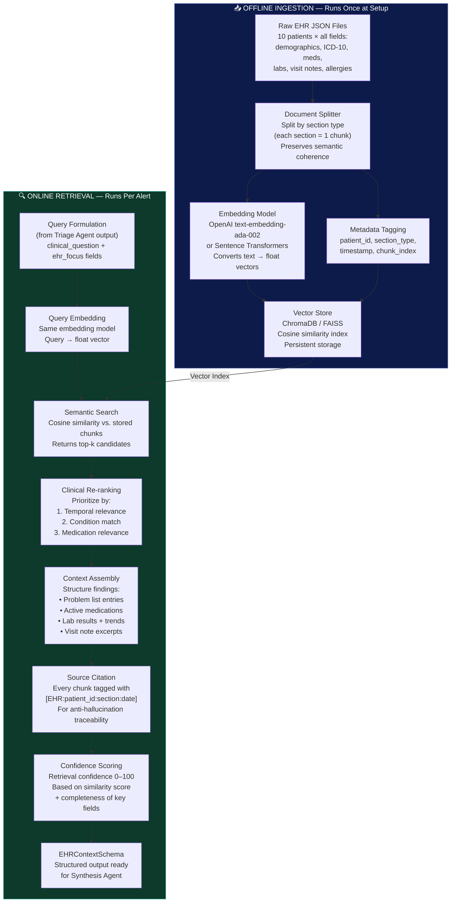

# 10.3 RAG Pipeline — EHR Retrieval Deep Dive

```mermaid
flowchart TD
    subgraph OFFLINE["📥 OFFLINE INGESTION — Runs Once at Setup"]
        RAW["Raw EHR JSON Files\n10 patients × all fields:\ndemographics, ICD-10, meds,\nlabs, visit notes, allergies"]
        SPLIT["Document Splitter\nSplit by section type\n(each section = 1 chunk)\nPreserves semantic coherence"]
        EMBED["Embedding Model\nOpenAI text-embedding-ada-002\nor Sentence Transformers\nConverts text → float vectors"]
        META["Metadata Tagging\npatient_id, section_type,\ntimestamp, chunk_index"]
        STORE["Vector Store\nChromaDB / FAISS\nCosine similarity index\nPersistent storage"]
        RAW --> SPLIT --> EMBED
        SPLIT --> META
        EMBED --> STORE
        META --> STORE
    end

    subgraph ONLINE["🔍 ONLINE RETRIEVAL — Runs Per Alert"]
        QFORM["Query Formulation\n(from Triage Agent output)\nclinical_question + ehr_focus fields"]
        QEMBED["Query Embedding\nSame embedding model\nQuery → float vector"]
        SEARCH["Semantic Search\nCosine similarity vs. stored chunks\nReturns top-k candidates"]
        RERANK["Clinical Re-ranking\nPrioritize by:\n1. Temporal relevance\n2. Condition match\n3. Medication relevance"]
        ASSEMBLE["Context Assembly\nStructure findings:\n• Problem list entries\n• Active medications\n• Lab results + trends\n• Visit note excerpts"]
        CITE["Source Citation\nEvery chunk tagged with\n[EHR:patient_id:section:date]\nFor anti-hallucination traceability"]
        SCORE["Confidence Scoring\nRetrieval confidence 0–100\nBased on similarity score\n+ completeness of key fields"]
        OUTPUT2["EHRContextSchema\nStructured output ready\nfor Synthesis Agent"]

        QFORM --> QEMBED --> SEARCH
        STORE -->|"Vector Index"| SEARCH
        SEARCH --> RERANK --> ASSEMBLE
        ASSEMBLE --> CITE --> SCORE --> OUTPUT2
    end

    style OFFLINE fill:#0d1b4a,stroke:#5c6bc0,color:#fff
    style ONLINE fill:#0d3a2a,stroke:#26a69a,color:#fff
```
