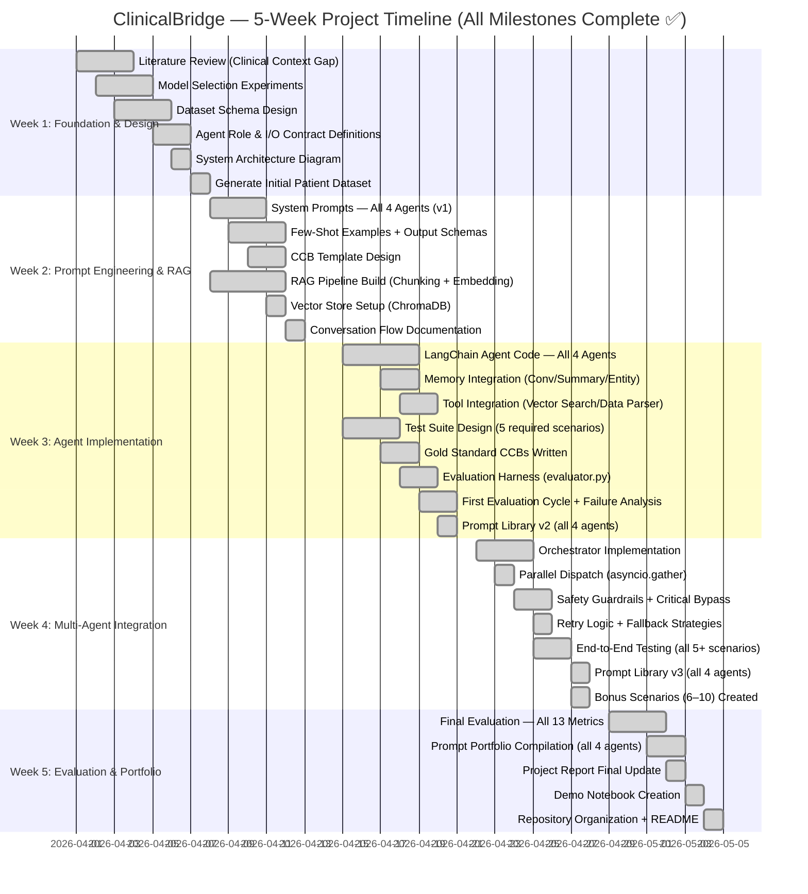

# 10.4 Project Timeline — 5 Weeks

```mermaid
gantt
    title ClinicalBridge — 5-Week Project Timeline (All Milestones Complete ✅)
    dateFormat  YYYY-MM-DD
    section Week 1: Foundation & Design
    Literature Review (Clinical Context Gap)      :done, 2026-04-01, 3d
    Model Selection Experiments                   :done, 2026-04-02, 3d
    Dataset Schema Design                         :done, 2026-04-03, 3d
    Agent Role & I/O Contract Definitions         :done, 2026-04-05, 2d
    System Architecture Diagram                   :done, 2026-04-06, 1d
    Generate Initial Patient Dataset              :done, 2026-04-07, 1d

    section Week 2: Prompt Engineering & RAG
    System Prompts — All 4 Agents (v1)            :done, 2026-04-08, 3d
    Few-Shot Examples + Output Schemas            :done, 2026-04-09, 3d
    CCB Template Design                           :done, 2026-04-10, 2d
    RAG Pipeline Build (Chunking + Embedding)     :done, 2026-04-08, 4d
    Vector Store Setup (ChromaDB)                 :done, 2026-04-11, 1d
    Conversation Flow Documentation               :done, 2026-04-12, 1d

    section Week 3: Agent Implementation
    LangChain Agent Code — All 4 Agents           :done, 2026-04-15, 4d
    Memory Integration (Conv/Summary/Entity)      :done, 2026-04-17, 2d
    Tool Integration (Vector Search/Data Parser)  :done, 2026-04-18, 2d
    Test Suite Design (5 required scenarios)      :done, 2026-04-15, 3d
    Gold Standard CCBs Written                    :done, 2026-04-17, 2d
    Evaluation Harness (evaluator.py)             :done, 2026-04-18, 2d
    First Evaluation Cycle + Failure Analysis     :done, 2026-04-19, 2d
    Prompt Library v2 (all 4 agents)              :done, 2026-04-20, 1d

    section Week 4: Multi-Agent Integration
    Orchestrator Implementation                   :done, 2026-04-22, 3d
    Parallel Dispatch (asyncio.gather)            :done, 2026-04-23, 1d
    Safety Guardrails + Critical Bypass           :done, 2026-04-24, 2d
    Retry Logic + Fallback Strategies             :done, 2026-04-25, 1d
    End-to-End Testing (all 5+ scenarios)         :done, 2026-04-25, 2d
    Prompt Library v3 (all 4 agents)              :done, 2026-04-27, 1d
    Bonus Scenarios (6–10) Created                :done, 2026-04-27, 1d

    section Week 5: Evaluation & Portfolio
    Final Evaluation — All 13 Metrics             :done, 2026-04-29, 3d
    Prompt Portfolio Compilation (all 4 agents)   :done, 2026-05-01, 2d
    Project Report Final Update                   :done, 2026-05-02, 1d
    Demo Notebook Creation                        :done, 2026-05-03, 1d
    Repository Organization + README              :done, 2026-05-04, 1d
```
