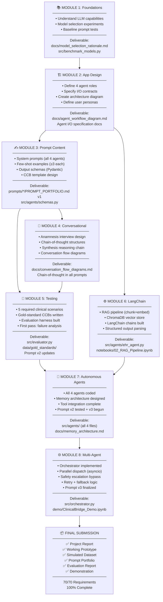

# 10.5 Build-Order & Module Dependency Flow

```mermaid
flowchart TD
    M1["📚 MODULE 1: Foundations\n─────────────────────\n• Understand LLM capabilities\n• Model selection experiments\n• Baseline prompt tests\n─────────────────────\nDeliverable:\ndocs/model_selection_rationale.md\nsrc/benchmark_models.py"]

    M2["🏗️ MODULE 2: App Design\n─────────────────────\n• Define 4 agent roles\n• Specify I/O contracts\n• Create architecture diagram\n• Define user personas\n─────────────────────\nDeliverable:\ndocs/agent_workflow_diagram.md\nAgent I/O specification docs"]

    M3["✍️ MODULE 3: Prompt Content\n─────────────────────\n• System prompts (all 4 agents)\n• Few-shot examples (≥3 each)\n• Output schemas (Pydantic)\n• CCB template design\n─────────────────────\nDeliverable:\nprompts/*/PROMPT_PORTFOLIO.md v1\nsrc/agents/schemas.py"]

    M4["💬 MODULE 4: Conversational\n─────────────────────\n• Anamnesis interview design\n• Chain-of-thought structures\n• Synthesis reasoning chain\n• Conversation flow diagrams\n─────────────────────\nDeliverable:\ndocs/conversation_flow_diagrams.md\nChain-of-thought in all prompts"]

    M5["🧪 MODULE 5: Testing\n─────────────────────\n• 5 required clinical scenarios\n• Gold-standard CCBs written\n• Evaluation harness built\n• First pass: failure analysis\n─────────────────────\nDeliverable:\nsrc/evaluator.py\ndata/gold_standards/\nPrompt v2 updates"]

    M6["⚙️ MODULE 6: LangChain\n─────────────────────\n• RAG pipeline (chunk+embed)\n• ChromaDB vector store\n• LangChain chains built\n• Structured output parsing\n─────────────────────\nDeliverable:\nsrc/agents/ehr_agent.py\nnotebooks/02_RAG_Pipeline.ipynb"]

    M7["🤖 MODULE 7: Autonomous Agents\n─────────────────────\n• All 4 agents coded\n• Memory architecture designed\n• Tool integration complete\n• Prompt v2 tested + v3 begun\n─────────────────────\nDeliverable:\nsrc/agents/ (all 4 files)\ndocs/memory_architecture.md"]

    M8["🌐 MODULE 8: Multi-Agent\n─────────────────────\n• Orchestrator implemented\n• Parallel dispatch (asyncio)\n• Safety escalation bypass\n• Retry + fallback logic\n• Prompt v3 finalized\n─────────────────────\nDeliverable:\nsrc/orchestrator.py\ndemo/ClinicalBridge_Demo.ipynb"]

    FINAL["📦 FINAL SUBMISSION\n─────────────────────\n✅ Project Report\n✅ Working Prototype\n✅ Simulated Dataset\n✅ Prompt Portfolio\n✅ Evaluation Report\n✅ Demonstration\n─────────────────────\n70/70 Requirements\n100% Complete"]

    M1 --> M2
    M2 --> M3
    M3 --> M4
    M3 --> M5
    M4 --> M5
    M2 --> M6
    M5 --> M7
    M6 --> M7
    M7 --> M8
    M8 --> FINAL
```
