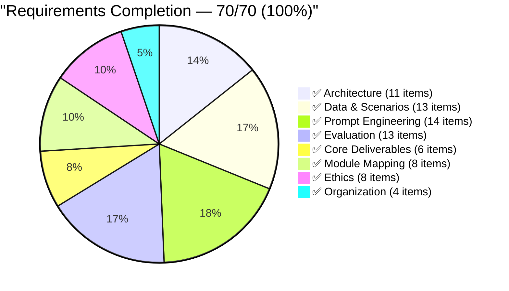

# 12.1 All Requirements — Completion Scorecard

```mermaid
pie title "Requirements Completion — 70/70 (100%)"
    "✅ Architecture (11 items)" : 11
    "✅ Data & Scenarios (13 items)" : 13
    "✅ Prompt Engineering (14 items)" : 14
    "✅ Evaluation (13 items)" : 13
    "✅ Core Deliverables (6 items)" : 6
    "✅ Module Mapping (8 items)" : 8
    "✅ Ethics (8 items)" : 8
    "✅ Organization (4 items)" : 4
```
